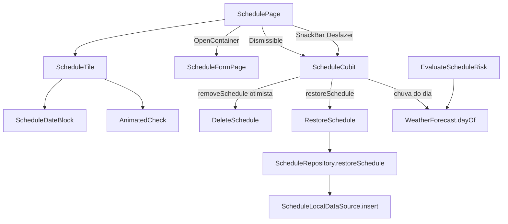

# Redesign da Agenda — Design

**Spec**: `.specs/features/schedule-redesign/spec.md`
**Status**: Approved (decisões do usuário em 2026-09-24: bloco de data, swipe com Desfazer, container transform, check desenhado, alerta pulsando)

---

## Architecture Overview

A regra de negócio não muda. O redesign acrescenta uma operação de dados (restaurar um agendamento excluído), um campo de apresentação (chuva do dia) e troca a camada visual da lista e do formulário.



---

## Code Reuse Analysis

| Component | Location | How to Use |
| --------- | -------- | ---------- |
| `ScheduleLocalDataSource.insert` | `lib/features/schedule/data/datasources/` | Restaurar = inserir a linha original; id duplicado já vira `CacheException` |
| Padrão de use case e repositório | `create_schedule.dart`, `schedule_repository_impl.dart` (`_write`) | `RestoreSchedule` e `restoreSchedule` seguem o mesmo molde, com a checagem de login |
| `EvaluateScheduleRisk._findDay` | `lib/features/schedule/domain/usecases/evaluate_schedule_risk.dart` | Vira `WeatherForecast.dayOf`, reutilizado pelo cubit para a chuva em mm |
| Formulário atual | `lib/features/schedule/presentation/widgets/schedule_form_sheet.dart` | Estado, validação e seletor de data migram para a tela cheia |
| Paleta de risco | `schedule_tile.dart` (`_paletteFor`), `AppColors` | Base das cores do bloco de data |
| Redução de movimento | `context.reduceMotion`, `FadeSlideIn`, `ScheduleAlertBanner` | Mesmo padrão: sem animação, o widget é devolvido parado, sem `Duration.zero` em `AnimatedSize` |
| Tempos | `AppMotion` | Durações e curvas; nada de milissegundos soltos |

---

## Components

### Dados e domínio

- **`ScheduleRepository.restoreSchedule(FertilizationSchedule schedule)`** → `Either<Failure, void>`. Sem login: `AuthFailure` sem tocar no banco. Com login: `insert` de `ScheduleRow` com `id`, `scheduledDate`, `note`, `createdAt` e `completedAt` do agendamento original e o `userId` da conta atual.
- **`RestoreSchedule`** (`UseCase<void, FertilizationSchedule>`), registrado no `ScheduleDataModule`.
- **`WeatherForecast.dayOf(DateTime date)`** → `DailyForecastPoint?`, comparando só o dia. `EvaluateScheduleRisk` passa a usá-lo.

### Cubit

- **`ScheduleItem.expectedRainMm`** (`double?`): chuva prevista para o dia de um agendamento não concluído e não passado, quando a previsão tem o dia; senão `null`.
- **`removeSchedule(String id)` otimista:** o id entra num conjunto de ocultos e o estado é emitido **antes** de chamar o use case, porque o `Dismissible` exige o item fora da árvore no frame seguinte ao gesto. Falha: o id sai do conjunto, a lista volta e sai `withActionFailure`. O id é esquecido quando o stream deixa de trazê-lo.
- **`restoreSchedule(FertilizationSchedule schedule)`:** chama `RestoreSchedule`; falha vira `withActionFailure`. O item volta pelo stream, na posição da ordenação.

### Widgets

- **`ScheduleDateBlock`** (`presentation/widgets/schedule_date_block.dart`): dia do mês e mês abreviado em maiúsculas (`DateFormat('MMM', 'pt_BR')`, sem ponto), cor de fundo por status. Recebe `pulse: bool`; quando `true` e sem redução de movimento, um `AnimationController` em `repeat(reverse: true)` anima escala e brilho. O controller é criado e descartado conforme `pulse` muda.
- **`AnimatedCheck`** (`presentation/widgets/animated_check.dart`): `StatefulWidget` com `AnimationController` de `AppMotion.medium`. Um `CustomPainter` desenha a borda e extrai o traço do check com `PathMetric.extractPath(0, length * progress)`. Marcar anima de 0 a 1, desmarcar de 1 a 0; com redução de movimento, `value` direto. `Semantics(checked:, onTap:)`, alvo de 48 x 48.
- **`ScheduleTile`** (reescrito): `Card` com `Row` [`ScheduleDateBlock` | conteúdo | `AnimatedCheck`]. Conteúdo: dia da semana (`DateFormat.EEEE('pt_BR')`, primeira letra maiúscula), observação, rótulo de status com ícone e "X,X mm previstos" quando em risco. Concluído: bloco neutro e texto esmaecido, mantendo as transições implícitas já implementadas. `Semantics` com o rótulo completo e `customSemanticsActions` para "Excluir". Sem menu: o `PopupMenuButton` sai.
- **`ScheduleFormPage`** (`presentation/pages/schedule_form_page.dart`): o formulário atual em tela cheia (`Scaffold`, `AppBar` com título de criar ou editar, botão "Salvar"). Devolve `ScheduleFormResult` pelo `Navigator.pop`. `ScheduleFormSheet` é removido.
- **`SchedulePage`**:
  - Cada item: `Dismissible(key: ValueKey(id), direction: endToStart, background: fundo `AppColors.danger` com ícone de lixeira)` envolvendo um `OpenContainer` cujo `closedBuilder` é o `ScheduleTile` e o `openBuilder` é a `ScheduleFormPage` em modo edição; itens concluídos não abrem.
  - FAB: `OpenContainer` com `closedBuilder` do botão estendido e `openBuilder` em modo criação.
  - `onClosed` do `OpenContainer` recebe o resultado e chama `addSchedule` ou `editSchedule`.
  - Transição: `transitionDuration` de `AppMotion.slow`, ou `Duration.zero` com redução de movimento (o `OpenContainer` troca a rota sem desenhar a transição).
  - Excluir, pelo swipe ou pela ação de acessibilidade: `removeSchedule` e `SnackBar(content: "Agendamento excluído", action: "Desfazer" → restoreSchedule(schedule), duration: 4 s)`, depois de `hideCurrentSnackBar`.
  - O `ScaffoldMessenger` é guardado em `didChangeDependencies` e o snackbar é escondido no `dispose` da página.
  - Saem o `_AnimatedScheduleTile`, o diálogo de confirmação e as chaves `scheduleDeleteConfirm*` do `.arb`.

---

## Data Models

```dart
final class ScheduleItem extends Equatable {
  final FertilizationSchedule schedule;
  final ScheduleRiskLevel risk;
  final bool isPastDue;
  final double? expectedRainMm; // novo
}
```

Nenhuma mudança de banco: restaurar usa a mesma tabela e o mesmo `insert`.

---

## Error Handling Strategy

| Error Scenario | Handling | User Impact |
| -------------- | -------- | ----------- |
| Exclusão falha no banco | Cubit tira o id dos ocultos, reemite a lista e sai `withActionFailure` | O card volta; snackbar de erro substitui o de Desfazer |
| Restauração falha (ex.: id já existe) | `CacheException` → `CacheFailure` → `withActionFailure` | Snackbar de erro |
| Sem login ao restaurar | `AuthFailure` sem tocar no banco | Snackbar de erro |
| Desfazer depois de sair da tela | Snackbar escondido no `dispose` | O Desfazer não existe mais; a exclusão fica |

---

## Risks & Concerns

| Concern | Location (file:line) | Impact | Mitigation |
| ------- | -------------------- | ------ | ---------- |
| `void _handleDelete() async` e espera por `Future.delayed` | `lib/features/schedule/presentation/pages/schedule_page.dart` (`_AnimatedScheduleTileState`) | Erro da exclusão se perde; animação por tempo fixo | Substituído pelo `Dismissible` no T12 |
| `Dismissible` exige o item fora da árvore logo após o gesto | `SchedulePage` | Assert "A dismissed Dismissible widget is still part of the tree" | Remoção otimista no cubit (T7), testada com o widget no T12 |
| Container transform troca bottom sheet por rota | formulário | Testes do formulário mudam de API | Testes migram no T11, com os mesmos cenários de janela e observação |
| Pulso em loop em vários cards | `ScheduleDateBlock` | Custo de repintura | Só itens em risco pulsam; `RepaintBoundary` no bloco; para com redução de movimento |

---

## Tech Decisions

| Decision | Choice | Rationale |
| -------- | ------ | --------- |
| Container transform | `OpenContainer` do pacote `animations` 3.x (oficial do time do Flutter) | Implementar a transição à mão exigiria rota e animação de forma customizadas; o pacote é o padrão do Material |
| Remoção otimista | Conjunto de ids ocultos no cubit | O `Dismissible` não espera o stream do banco |
| Desfazer | Reinserir a linha original, com o mesmo id | Volta exatamente o mesmo registro; o aviso do painel se atualiza sozinho pelo stream |
| Check | `CustomPainter` + `PathMetric` | Traçado progressivo real; o `Checkbox` do Material não anima o desenho |
