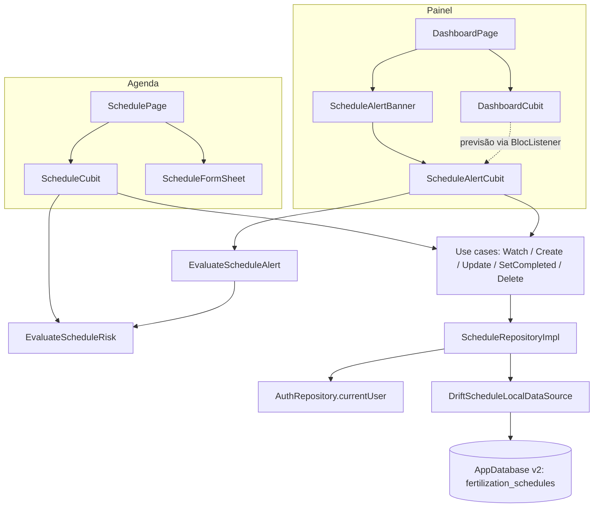

# Caderno de agendamento — Design

**Spec**: `.specs/features/schedule/spec.md`
**Status**: Approved (abordagem do aviso escolhida pelo usuário em 2026-09-23: cubit próprio)

---

## Architecture Overview

A Agenda segue a Clean Architecture das outras features. Os agendamentos ficam numa tabela nova do `AppDatabase` (drift) que o app já usa. A leitura é um `Stream` do drift (`watch()`), então qualquer escrita, em qualquer tela, atualiza automaticamente quem estiver assistindo: a lista da Agenda e o aviso do painel.

O painel ganha um cubit próprio para o aviso (`ScheduleAlertCubit`). Ele assiste aos agendamentos e recebe a previsão do `DashboardCubit` por um `BlocListener`, sem que o `DashboardCubit` mude.



**Módulos (go_router_modular)**

- `ScheduleDataModule` (novo, módulo de serviço, só binds, no molde do `WeatherModule`): data source, repositório e use cases.
- `ScheduleModule` (rota `/agenda`): importa `WeatherModule` e `ScheduleDataModule`; registra o `ScheduleCubit`.
- `DashboardModule`: passa a importar `ScheduleDataModule`; registra o `ScheduleAlertCubit`.
- `AppModule`: ganha `Clock` e `Uuid` (infra de app inteiro); perde `FirebaseFirestore`.

---

## Code Reuse Analysis

### Existing Components to Leverage

| Component | Location | How to Use |
| --------- | -------- | ---------- |
| `AppDatabase` + padrão de tabela | `lib/core/database/app_database.dart`, `lib/core/database/tables/cached_forecasts_table.dart` | Nova tabela no mesmo arquivo de banco, mesmo estilo de comentário (analogia com Room) |
| Padrão de data source drift | `lib/features/weather/data/datasources/drift_weather_local_data_source.dart` | Mesmo formato de classe (`const`, recebe `AppDatabase`) |
| Teste de banco em memória | `test/core/database/app_database_test.dart` | `AppDatabase.withExecutor(NativeDatabase.memory())` |
| Módulo de serviço | `lib/features/weather/weather_module.dart` | Modelo do `ScheduleDataModule` |
| Mapeamento de erro | `lib/core/error/exception_mapper.dart` (`AppExceptionToFailure.toFailure()`) | Repositório captura `AppException` e devolve `Failure` |
| Contratos de use case | `lib/core/usecase/usecase.dart` | `UseCase`, `SyncUseCase`, `StreamUseCase`, `NoParams` |
| `AuthRepository.currentUser` | `lib/features/auth/domain/repositories/auth_repository.dart` | Fonte do `uid` do dono, sem importar Firebase na Agenda |
| `EvaluateScheduleRisk` (rascunho) | `lib/features/schedule/domain/usecases/evaluate_schedule_risk.dart` | Mantido; `EvaluateScheduleAlert` reusa |
| Limiar de perigo | `EvaluateApplicationSafety.dangerThresholdMm` | Já usado pelo `EvaluateScheduleRisk` |
| Rascunho de UI | `schedule_page.dart`, `schedule_tile.dart`, `schedule_cubit.dart`, `schedule_state.dart` | Base da apresentação; evoluem para seções, edição e conclusão |
| `FadeSlideIn`, `context.showSnack`, `context.reduceMotion`, `AppMotion`, `AppColors`, `AppSpacing` | `lib/core/...` | UI no padrão do app |
| Rotas e menu (rascunho) | `app_routes.dart` (`AppRoute.schedule`), `app_drawer.dart` | Já apontam para `/agenda` |

### Integration Points

| System | Integration Method |
| ------ | ------------------ |
| Banco local | `AppDatabase` passa de v1 para v2; `MigrationStrategy` com `stepByStep` gerado pelo `drift_dev make-migrations` |
| Auth | `ScheduleRepositoryImpl` lê `AuthRepository.currentUser?.uid` (singleton do `AppModule`) |
| Previsão | `ScheduleCubit` busca como hoje (cache-first); `ScheduleAlertCubit` recebe a previsão já carregada pelo painel |
| Navegação | Banner do painel chama `context.pushNamed(AppRoute.schedule.name)` |

---

## Components

### Utilitários de core

- **Purpose**: Tempo e ids determinísticos e injetáveis; janela da previsão com dono único.
- **Location**:
  - `package:clock` (`Clock`) e `package:uuid` (`Uuid`) como dependências diretas; bind em `AppModule`.
  - `lib/core/extensions/date_extensions.dart`: `DateTime.dateOnly` (meia-noite local) e `DateTime.isSameDay(other)`.
  - `WeatherForecast.coverageDays = 7` em `lib/features/weather/domain/entities/weather_forecast.dart`; `OpenMeteoRemoteDataSource` passa a usar essa constante no parâmetro `forecast_days` (hoje é o literal `7`).
  - `ValidationFailure` em `lib/core/error/failure.dart`.
- **Reuses**: nada; são peças pequenas e novas.

### Domínio

- **`FertilizationSchedule`** (entidade, rascunho evolui): `id`, `scheduledDate` (data sem hora), `createdAt`, `note?`, **`completedAt?`**, getter `isCompleted`.
- **`SchedulingWindow`** (`domain/entities/scheduling_window.dart`): valor puro. `SchedulingWindow.startingAt(DateTime today)` → `first = today.dateOnly`, `last = first + (WeatherForecast.coverageDays - 1) dias`; `bool contains(DateTime date)`; `DateTime clamp(DateTime date)` (para abrir o seletor na edição).
- **`ScheduleNote`** (`domain/entities/schedule_note.dart`): `static const maxLength = 200`; `static String? normalize(String? raw)` → trim, vazio vira `null`. Texto acima do limite é tratado pelo use case como `ValidationFailure`.
- **`ScheduleRepository`** (contrato, evolui):
  - `Stream<List<FertilizationSchedule>> watchSchedules()`
  - `Future<Either<Failure, void>> createSchedule({required DateTime scheduledDate, String? note})`
  - `Future<Either<Failure, void>> updateSchedule({required String id, required DateTime scheduledDate, String? note})`
  - `Future<Either<Failure, void>> setScheduleCompleted({required String id, required bool completed})`
  - `Future<Either<Failure, void>> deleteSchedule(String id)`
- **Use cases**:
  - `WatchSchedules`, `DeleteSchedule` (rascunho, sem mudança).
  - `CreateSchedule(repository, clock)` e `UpdateSchedule(repository, clock)`: validam `SchedulingWindow.startingAt(clock.now()).contains(date)` e o tamanho da nota; normalizam a nota; data vai como `dateOnly`. Falha de validação → `ValidationFailure`, sem chamar o repositório.
  - `SetScheduleCompleted(repository)`.
  - `EvaluateScheduleRisk` (rascunho, sem mudança).
  - **`EvaluateScheduleAlert`** (`SyncUseCase<ScheduleAlert?, EvaluateScheduleAlertParams>`): params `schedules`, `forecast?`, `today`. Regras na ordem: descarta concluídos e datas antes de hoje → conta os em risco (`EvaluateScheduleRisk`, só com previsão) → se > 0, `ScheduleAlert.risk(count)` → senão, algum para hoje → `ScheduleAlert.today()` → senão, algum para amanhã → `ScheduleAlert.tomorrow()` → senão `null`.
- **`ScheduleAlert`** (`domain/entities/schedule_alert.dart`): `sealed class` com `ScheduleRiskAlert(int count)`, `ScheduleTodayReminder`, `ScheduleTomorrowReminder`; `Equatable`.

### Dados

- **Tabela `FertilizationSchedules`** (`lib/core/database/tables/fertilization_schedules_table.dart`), `@DataClassName('ScheduleRow')` para não colidir com a entidade:
  - `id` TEXT PK (UUID v4), `userId` TEXT, `scheduledDate` DATETIME, `note` TEXT NULL, `createdAt` DATETIME, `completedAt` DATETIME NULL.
  - Índice `@TableIndex(name: 'schedules_user_date', columns: {#userId, #scheduledDate})`.
- **`AppDatabase`** v2: `tables: [CachedForecasts, FertilizationSchedules]`, `schemaVersion => 2`, `migration` com `onUpgrade: stepByStep(from1To2: (m, schema) async => m.createTable(schema.fertilizationSchedules))`.
- **`ScheduleLocalDataSource`** (interface) e **`DriftScheduleLocalDataSource`**:
  - `Stream<List<ScheduleRow>> watchByUser(String userId)`: `scheduledDate` crescente, `createdAt` crescente como desempate.
  - `Future<void> insert(ScheduleRow row)`
  - `Future<void> updateDateAndNote({required String id, required String userId, required DateTime scheduledDate, required String? note})`
  - `Future<void> setCompletedAt({required String id, required String userId, required DateTime? completedAt})`
  - `Future<void> delete({required String id, required String userId})`
  - Toda escrita filtra por `id` **e** `userId`. Zero linhas afetadas → `CacheException('Agendamento não encontrado.')`. `SqliteException` (de `package:drift/native.dart`) → `CacheException('Não foi possível salvar o agendamento.')`.
- **Mapper** `ScheduleRow.toEntity()` em `lib/features/schedule/data/models/schedule_row_mapper.dart`.
- **`ScheduleRepositoryImpl(local, authRepository, clock, uuid)`**:
  - Sem usuário logado: escritas → `Left(AuthFailure('É preciso estar logado para usar a agenda.'))`, sem tocar no banco; `watchSchedules()` → `Stream.value(const [])`.
  - `createSchedule`: `id = uuid.v4()`, `createdAt = clock.now()`.
  - `setScheduleCompleted(completed: true)` grava `clock.now()`; `false` grava `null`.
  - `AppException` → `e.toFailure()`.
- **Removidos**: `FirestoreScheduleDataSource`, `ScheduleRemoteDataSource`, `ScheduleModel` (+ `.freezed.dart`), `firestore.rules`, dependência `cloud_firestore`, bind `FirebaseFirestore`.

### Apresentação: Agenda

- **`ScheduleState`**: `status` (`loading` | `loaded` | `error`), `upcoming: List<ScheduleItem>`, `completed: List<ScheduleItem>`, `window: SchedulingWindow`, `failure?`; `withActionFailure(...)` continua para erros de ação (snackbar).
- **`ScheduleItem`** (record ou classe `Equatable`): `schedule`, `risk: ScheduleRiskLevel`, `isPastDue: bool`.
- **`ScheduleCubit(watchSchedules, createSchedule, updateSchedule, setScheduleCompleted, deleteSchedule, getCurrentLocation, getForecast, evaluateScheduleRisk, clock)`**: mesma combinação de stream + previsão do rascunho; `_emitLoaded` separa seções, ordena (concluídos por data decrescente), calcula `isPastDue` com `clock` e só avalia risco para não concluídos de hoje em diante. Ações: `addSchedule(date, note)`, `editSchedule(id, date, note)`, `setCompleted(id, completed)`, `removeSchedule(id)`. Erro de stream antes de carregar → `error`; depois de carregado → mantém a lista.
- **`ScheduleFormSheet`** (`presentation/widgets/schedule_form_sheet.dart`): bottom sheet para criar e editar. Campo de data que abre `showDatePicker(firstDate: window.first, lastDate: window.last, initialDate: window.clamp(atual))` e `TextField(maxLength: ScheduleNote.maxLength)`. Retorna `({DateTime date, String? note})?`.
- **`ScheduleTile`** (evolui): data, observação (se houver), rótulo de risco ou "Data passada", checkbox de concluir, toque para editar (só não concluídos), menu com "Excluir". Concluído com estilo apagado.
- **`SchedulePage`** (evolui): `CustomScrollView` com as seções "Próximos" e "Concluídos" (seção vazia não aparece), estado vazio geral, FAB "Agendar" abre o sheet, diálogo de exclusão do rascunho.

### Apresentação: aviso no painel

- **`ScheduleAlertCubit(watchSchedules, evaluateScheduleAlert, clock)`** (`features/schedule/presentation/alert/`): estado `ScheduleAlertState(alert: ScheduleAlert?)`. Assina `watchSchedules` na criação; `updateForecast(WeatherForecast? forecast)` guarda a previsão e recalcula; erro no stream → `alert: null`; cancela a assinatura no `close()`.
- **`ScheduleAlertBanner`** (`features/schedule/presentation/alert/schedule_alert_banner.dart`): `BlocBuilder` que não ocupa espaço quando `alert == null`; card vermelho para risco (com a contagem) e card de destaque para lembrete (hoje/amanhã); `onTap` recebido por parâmetro. Transição de entrada com `AnimatedSize`/`AnimatedSwitcher`, respeitando `context.reduceMotion`.
- **`DashboardPage`**: `MultiBlocProvider` com `ScheduleAlertCubit`; `BlocListener<DashboardCubit, DashboardState>` chama `updateForecast(state.forecast)` quando `status == loaded`; o banner fica entre o cabeçalho e a seção de previsão, e aparece mesmo com a previsão carregando ou com erro (lembrete continua valendo).

---

## Data Models

```dart
// lib/core/database/tables/fertilization_schedules_table.dart
@DataClassName('ScheduleRow')
@TableIndex(name: 'schedules_user_date', columns: {#userId, #scheduledDate})
class FertilizationSchedules extends Table {
  TextColumn get id => text()();                 // UUID v4
  TextColumn get userId => text()();             // uid do Firebase Auth
  DateTimeColumn get scheduledDate => dateTime()(); // meia-noite local
  TextColumn get note => text().nullable()();
  DateTimeColumn get createdAt => dateTime()();
  DateTimeColumn get completedAt => dateTime().nullable()();

  @override
  Set<Column> get primaryKey => {id};
}
```

```dart
// domain
final class FertilizationSchedule extends Equatable {
  final String id;
  final DateTime scheduledDate;
  final DateTime createdAt;
  final String? note;
  final DateTime? completedAt;
  bool get isCompleted => completedAt != null;
}

sealed class ScheduleAlert extends Equatable {}
final class ScheduleRiskAlert extends ScheduleAlert { final int count; }
final class ScheduleTodayReminder extends ScheduleAlert {}
final class ScheduleTomorrowReminder extends ScheduleAlert {}
```

**Relationships**: `userId` referencia a conta do Firebase Auth (sem FK, a conta não está no banco). Nenhuma relação com `cached_forecasts`.

---

## Error Handling Strategy

| Error Scenario | Handling | User Impact |
| -------------- | -------- | ----------- |
| Sem usuário logado ao escrever | Repositório devolve `AuthFailure` sem tocar no banco | Snackbar "É preciso estar logado para usar a agenda." |
| Data fora da janela ou nota > 200 | Use case devolve `ValidationFailure` sem chamar o repositório | Snackbar com a mensagem; a UI já impede os dois casos, então é defesa em profundidade |
| `SqliteException` na escrita | Data source → `CacheException` → `CacheFailure` | Snackbar; lista mantida |
| Editar/concluir/excluir id inexistente ou de outro usuário | Zero linhas afetadas → `CacheException('Agendamento não encontrado.')` | Snackbar |
| Stream falha antes do primeiro carregamento | `ScheduleCubit` → `status: error` | Tela de erro da Agenda |
| Stream falha depois de carregado | Mantém a lista | Nada visível |
| Stream falha no painel | `ScheduleAlertCubit` → `alert: null` | Painel normal, sem aviso |
| Sem localização ou sem previsão na Agenda | Risco `unknown` ("sem previsão") | Lista aparece normalmente |

---

## Risks & Concerns

| Concern | Location (file:line) | Impact | Mitigation |
| ------- | -------------------- | ------ | ---------- |
| Migração de banco já instalado (v1) | `lib/core/database/app_database.dart:27` | Abrir o app atualizado sem migração derruba o banco ou perde o cache | T1 salva o snapshot v1 **antes** de mudar tabelas; T6 gera o `stepByStep` e o teste de migração v1 → v2 com dado preservado |
| Literal `7` duplicado com a janela | `lib/features/weather/data/datasources/open_meteo_remote_data_source.dart:31` | Mudar a janela da previsão sem mudar a da Agenda deixaria agendamentos sem risco avaliável | T2 cria `WeatherForecast.coverageDays` e troca o literal |
| `DateTime.now()` espalhado | `schedule_page.dart` (`_pickAndAddSchedule`), `schedule_repository_impl.dart` (`createdAt`) | Testes de "hoje/amanhã/data passada" não determinísticos | `Clock` injetado em use cases, cubits e repositório (AGD-23) |
| Rascunho acoplado ao Firebase | `firestore_schedule_data_source.dart` (`FirebaseAuth.currentUser`) | Agenda dependente do Firestore | Removido no T6; o dono vem de `AuthRepository`, que já é abstração do domínio |
| Descarte de módulos importados por dois módulos | `ScheduleDataModule` importado pela Agenda e pelo painel | Voltar da Agenda descartar binds ainda usados pelo painel | Cubits resolvem tudo no construtor (nenhum `Modular.get` tardio); T13 inclui teste manual de ida e volta Agenda ↔ painel no aparelho. Mesmo desenho já usado com o `WeatherModule` |
| `FadeSlideIn` remonta o filho na entrada | `lib/core/widgets/fade_slide_in.dart:49` | Lista da Agenda anima duas vezes | Fora do escopo (backlog do PR #1); não usar `FadeSlideIn` no banner |
| `daily.first` sem guarda de lista vazia | `lib/features/dashboard/presentation/widgets/forecast_section.dart:31` | Pré-existente | Fora do escopo; o banner não depende disso |

---

## Tech Decisions

| Decision | Choice | Rationale |
| -------- | ------ | --------- |
| Id do agendamento | UUID v4 gerado no aparelho (`package:uuid`) | Não depende do banco para existir; se um dia houver sync em nuvem, ids gerados no cliente não colidem |
| Data class da tabela | `@DataClassName('ScheduleRow')` e mapper para a entidade; sem model intermediário | A linha do drift já é o "model" da camada de dados; o `ScheduleModel` só existia pelo `Timestamp` do Firestore |
| Relógio | `package:clock` (`Clock`, `Clock.fixed` nos testes) | Pacote do time do Dart, injetável sem abstração própria |
| Validação | Janela e nota validadas nos use cases, e a UI impede os mesmos casos | Regra de negócio no domínio; UI só dá conforto |
| Dono dos dados | `uid` vindo de `AuthRepository.currentUser` | A Agenda não importa Firebase; troca de provedor de login não afeta a feature |
| Migração | `drift_dev make-migrations` (snapshot por versão + `stepByStep` + teste gerado) | É o fluxo oficial do drift, o equivalente do `MigrationTestHelper` do Room |
| Onde vive o aviso | Cubit e banner na feature `schedule`, embutidos pelo painel | A regra é da Agenda; o painel só hospeda, como já faz com `WeatherCondition` |
