<div align="center">

<!-- Logo ou ícone do app (ex.: 120x120) -->


# EcoSafra

**Adube na hora certa. Proteja o rio.**

Projeto acadêmico da UPX 7 no Centro Universitário Newton Paiva.

Aplicativo Android, offline-first, que avisa o produtor rural quando aplicar fertilizante
vai coincidir com chuva forte, evitando o escoamento do insumo para rios e córregos.


<!-- Captura principal: o painel com o card de decisão (ex.: 280px de largura) -->
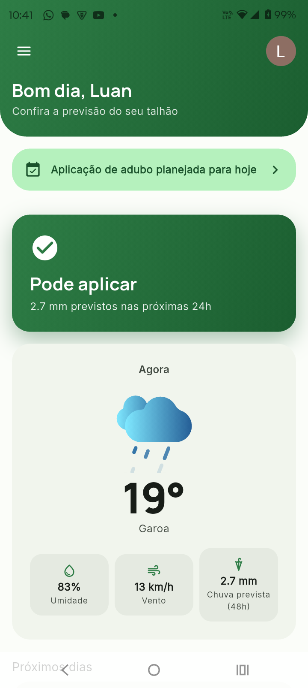

</div>

---

## O problema

Fertilizante aplicado pouco antes de uma chuva forte não chega a agir no solo: escoa pela
superfície e leva nitrogênio e fósforo para os corpos d'água, o que causa perda de insumo e
contribui para a eutrofização. A previsão do tempo existe, mas chega ao produtor em
números soltos, e não como uma resposta à pergunta que importa: **posso adubar agora?**

O talhão ainda impõe outra restrição. No Censo Agropecuário de 2017, só 28,2% dos
estabelecimentos rurais tinham acesso à internet (IBGE, 2019). Um app que depende da rede
para funcionar não serve no lugar em que a decisão é tomada.

## A solução

O EcoSafra lê a previsão da [Open-Meteo](https://open-meteo.com/) para a localização do
aparelho e a transforma numa recomendação de leitura imediata, **verde, amarela ou
vermelha**, com a chuva prevista e a perda estimada de insumo. Tudo fica salvo no aparelho:
**sem sinal, o app abre na hora com a última previsão** e diz de quando ela é.

O produtor também planeja as próximas aplicações numa agenda. Quando a previsão muda e um
dia planejado vira dia de chuva forte, o painel avisa antes.

> Relação com os Objetivos de Desenvolvimento Sustentável da ONU: **ODS 6** (água potável e
> saneamento, meta 6.3), **ODS 13** (ação contra a mudança do clima) e **ODS 14 e 15** (vida na
> água e vida terrestre).

## Funcionalidades

- **Decisão de adubação:** chuva acumulada nas próximas 24 h classificada em *pode aplicar*,
  *aplique com cautela* ou *não aplique*, com a estimativa de perda de insumo no pior caso.
- **Offline-first:** a última previsão abre instantaneamente do banco local; o app só tenta a
  rede depois de confirmar que há conexão, sem deixar ninguém esperando um timeout.
- **Agenda de aplicações:** criar, editar, concluir e excluir, com datas limitadas ao período
  que a previsão cobre.
- **Aviso no painel:** alerta quando um plano cai em dia de chuva forte e lembrete quando há
  aplicação para hoje ou amanhã.
- **Clima animado:** animações Lottie por condição do tempo, que param com "remover animações"
  ligado no sistema.
- **Login com Google** e dados separados por conta no mesmo aparelho.
- **Tema claro e escuro** derivados do Material 3, sem nenhum `if (isDarkMode)` no código.

## Telas

<!--
  Adicione as capturas em docs/images/ com os nomes abaixo (PNG, retrato, ~1080px de altura).
  Veja docs/images/README.md para a lista completa.
-->

| Login | Painel | Painel sem internet |
| :---: | :---: | :---: |
| 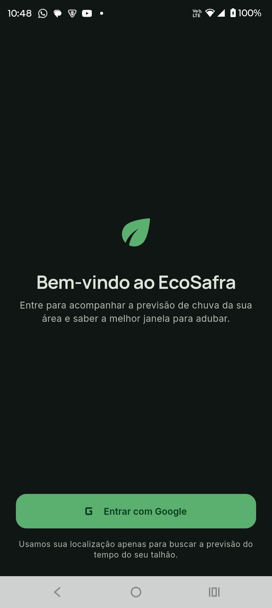 | 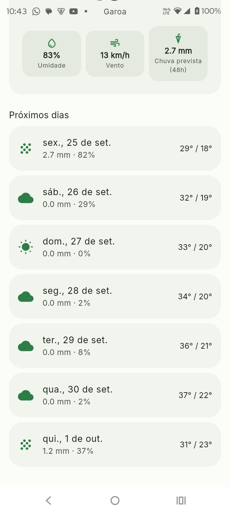 | 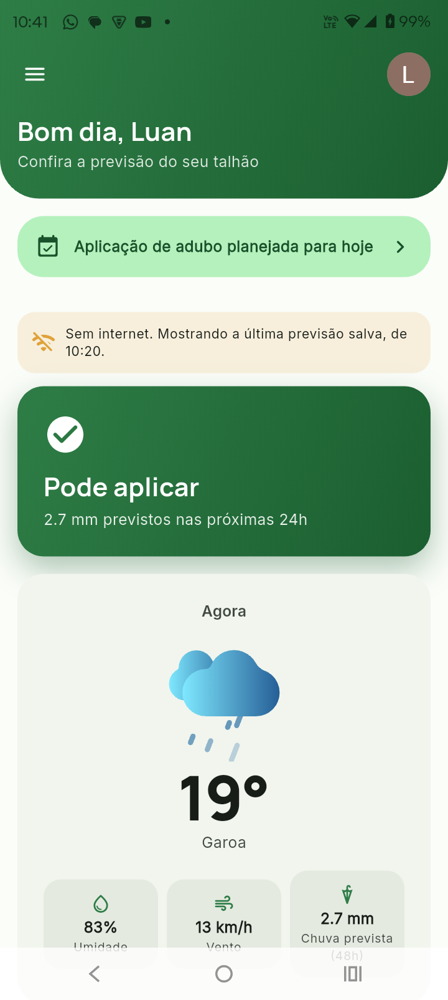 |

| Agenda | Novo agendamento | Aviso de risco |
| :---: | :---: | :---: |
| 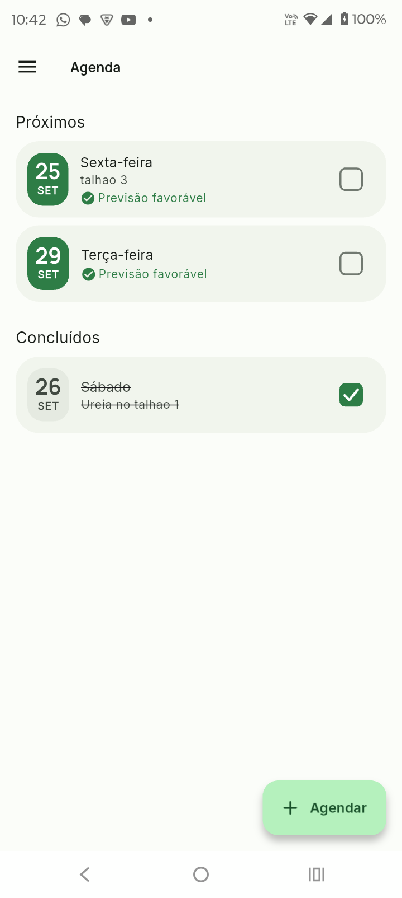 | 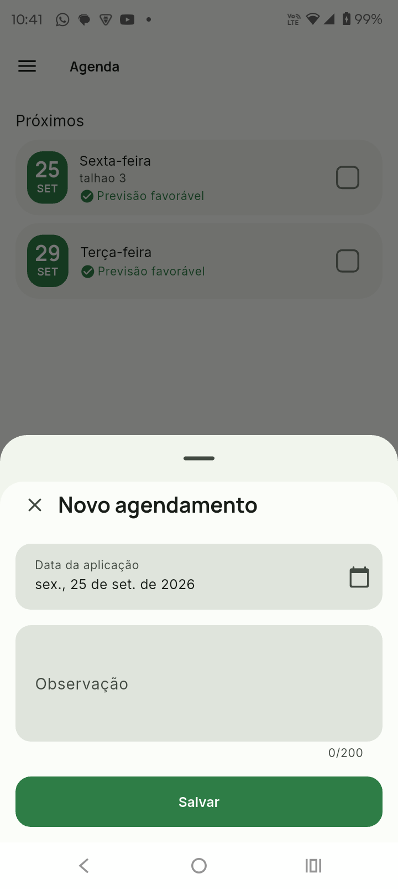 | 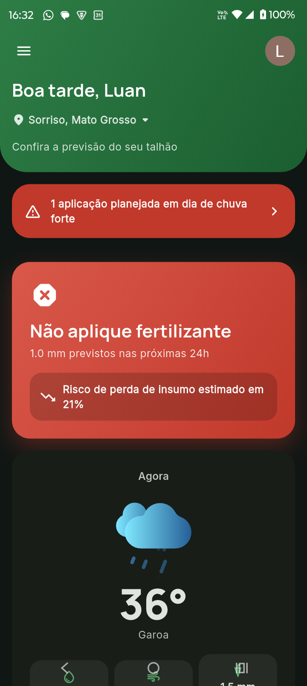 |

| Tema escuro | Menu |
| :---: | :---: |
| 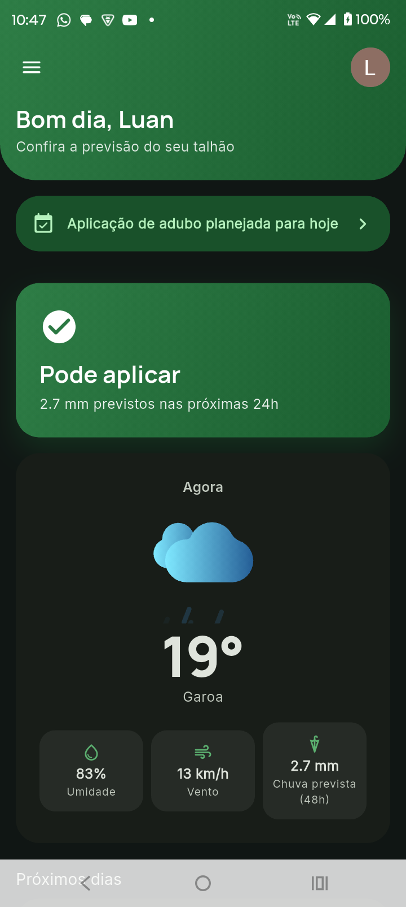 | 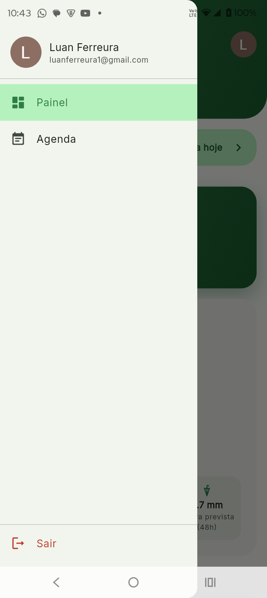 |

<!-- Opcional: um GIF curto do fluxo (abrir o app sem internet → agendar → aviso no painel) -->
<!-- <p align="center"></p> -->

## Arquitetura

Clean Architecture organizada por feature. Cada feature é um `Module` do
[`go_router_modular`](https://pub.dev/packages/go_router_modular), que declara as próprias
rotas e dependências e as descarta quando o usuário sai da rota.

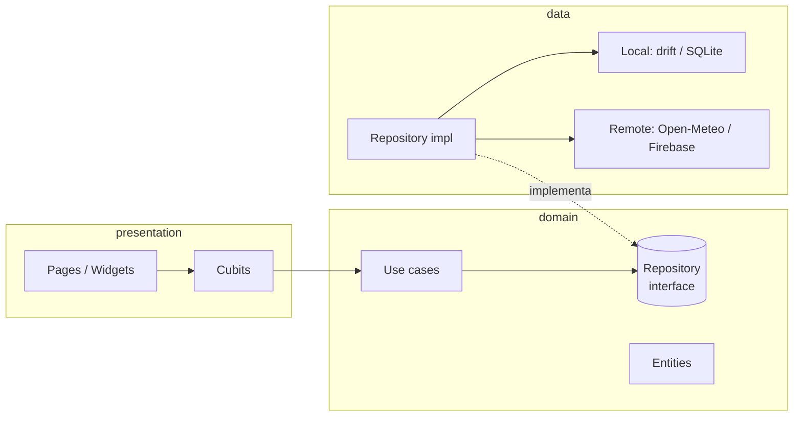

- **`domain`** não importa Flutter nem infraestrutura: entidades, contratos de repositório e
  use cases puros, testáveis sem mock de plataforma.
- **`data`** é a única camada que conhece Dio, drift e Firebase. Exceções de infraestrutura
  viram `Failure` na fronteira do repositório (`Either<Failure, T>`, com `fpdart`).
- **`presentation`** usa um Cubit por tela, com estado imutável e `Equatable`.

### Offline-first, na prática

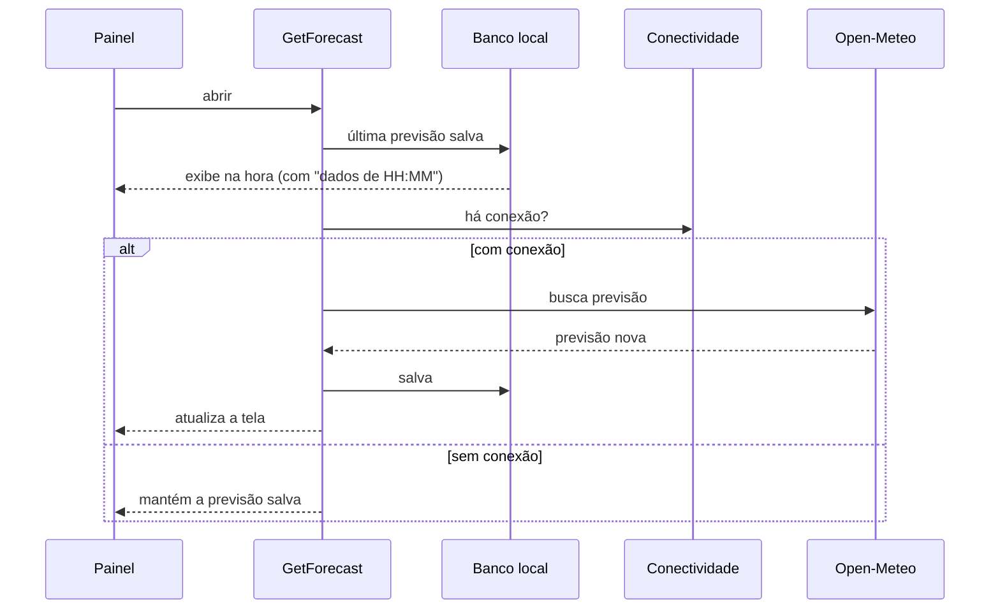

`GetForecast` é um `Stream`: emite primeiro o cache e depois a rede. A tela nunca mostra um
carregamento se já existe algo salvo para exibir.

### Decisões técnicas

| Decisão | Por quê |
| --- | --- |
| **Dados do usuário só no banco local** (drift/SQLite) | Funciona no talhão sem sinal e sem configurar nada no console. Uma sincronização em nuvem, se vier, entra atrás da mesma interface de repositório. |
| **Migrações versionadas** (`drift_dev make-migrations`) | Aparelhos já instalados sobem de versão do banco sem perder o cache. Cada versão tem um snapshot, e um teste compara o banco migrado com o instalado do zero. |
| **Checar a conexão antes de chamar a rede** | Sem internet é o caso comum no campo; esperar um timeout para descobrir isso seria a experiência padrão, não a exceção. |
| **`Clock` e `Uuid` injetados** | "Hoje", "amanhã", "data passada" e ids gerados no aparelho ficam determinísticos nos testes. |
| **Id do agendamento gerado no aparelho** (UUID v4) | O registro existe antes de chegar ao banco e não colide com outro aparelho caso haja sincronização no futuro. |
| **Cada escrita filtra por id e por dono** | Um usuário nunca altera o agendamento de outro no mesmo aparelho. |
| **Um cubit próprio para o aviso do painel** | O cubit do clima continua com uma responsabilidade só; o aviso recebe a previsão já carregada, sem buscar de novo. |

## Stack

| Área | Tecnologia |
| --- | --- |
| Framework | Flutter 3.44 · Dart 3.12 |
| Estado | `flutter_bloc` (Cubit) |
| Rotas e injeção de dependência | `go_router_modular` |
| Banco local | `drift` (SQLite) + `drift_dev` |
| Rede | `dio`, `connectivity_plus` |
| Autenticação | `firebase_auth` + `google_sign_in` |
| Localização | `geolocator` |
| Erros funcionais | `fpdart` (`Either`) |
| Modelos | `freezed`, `json_serializable`, `equatable` |
| Animações | `lottie` e animações implícitas do Flutter |
| Testes | `flutter_test`, `bloc_test`, `mocktail` |
| Lint | `very_good_analysis` |

## Qualidade

- **Mais de 400 testes** automatizados, entre unidade, widget, banco em memória e migração de schema.
- **Histórico legível:** Conventional Commits, um commit por tarefa, cada um compilando e passando
  nos testes sozinho.

## Estrutura

```
lib/
├── app/                 # widget raiz, AppModule (binds globais e composição de rotas)
├── core/                # banco, rede, erros, tema, extensões e widgets compartilhados
└── features/
    ├── splash/
    ├── auth/            # login com Google
    ├── weather/         # previsão offline-first e motor de decisão
    ├── dashboard/       # painel principal
    └── schedule/        # agenda de aplicações e aviso do painel
        ├── domain/      # entidades, contrato do repositório, use cases
        ├── data/        # data source drift e repositório
        └── presentation/# cubits, páginas e widgets
```

## Como rodar

**Pré-requisitos:** Flutter 3.44 (Dart 3.12) e um aparelho ou emulador Android 8.0 ou superior.

```bash
git clone https://github.com/luan-fb/EcoSafra.git
cd EcoSafra
flutter pub get
dart run build_runner build --delete-conflicting-outputs
flutter run
```

- **Login com Google:** funciona direto no build de debug. O projeto usa um keystore de debug
  compartilhado ([`android/keystore/`](android/keystore/)), cuja assinatura já está registrada
  no Firebase, então qualquer clone gera um APK aceito pelo Google Sign-In.
- **Clima:** a Open-Meteo é pública e não exige chave.
- **iOS:** ainda não configurado. Exige registrar o app no Firebase e adicionar o
  `GoogleService-Info.plist`.

**Testes e análise:**

```bash
flutter analyze
flutter test
```

## Roadmap

- [ ] Calcular a janela de 24 h a partir da hora atual (hoje ela começa na primeira hora do dia
      retornada pela API)
- [ ] Aviso visível de que a recomendação tem caráter informativo e não substitui orientação
      agronômica
- [ ] Informar a localização manualmente quando o GPS não estiver disponível
- [ ] Histórico das análises
- [ ] Notificações no aparelho para os avisos da agenda
- [ ] Usar a umidade do solo, que o app já recebe, no motor de decisão
- [ ] Exibir no app a atribuição "Weather data by Open-Meteo.com", exigida pela licença CC BY 4.0
- [ ] Suporte a iOS

## Créditos

- [Weather data by Open-Meteo.com](https://open-meteo.com/), licença CC BY 4.0.
- Animações de clima: [LottieFiles](https://lottiefiles.com/).
- Dado de conectividade rural: IBGE, *Censo Agro 2017: população ocupada nos estabelecimentos
  agropecuários cai 8,8%*, Agência de Notícias IBGE, 25 out. 2019.

> A recomendação do EcoSafra é informativa e não substitui a orientação de um profissional de
> agronomia, a análise de solo ou as características do fertilizante e do terreno.
